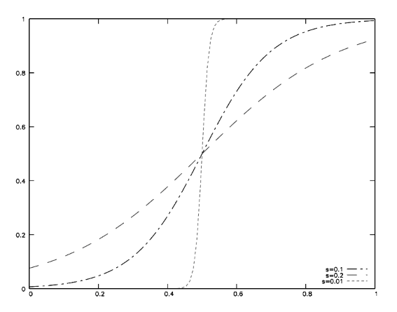

## 1. 调整红色通道曲线

首先利用下面这个公式调整图像R通道的曲线
$$
\frac{1}{1+e^{-\frac{x-0.5}{s}}}
$$
s: 自定义常数，s越小，曲线越陡，r值小于128的像素点会被调整得非常暗，大于128的会非常亮，这里选择 s = 0.1。s接近1时基本变成直线



利用事先创建好的查找表快速找到变换后对应的值

```python
self.E = np.exp(1.0)
# create lookup table according to curve
self.lut = np.linspace(0, 255, num=256, dtype=np.float32)
self.lut = 255 * (1. / (self.E**-(((self.lut/255.0)-0.5)/0.1) + 1.))
self.lut = np.around(self.lut).astype(np.uint8)
```


## 2. 分离R通道并进行曲线变换

```python
b, g, r = img[:, :, 0], img[:, :, 1], img[:, :, 2]
r = cv2.LUT(r, self.lut)
# merge 3 separate channels to 1 image
curve_trans = cv2.merge([b, g, r])
curve_trans = curve_trans.astype(np.float32)
```

- 图像用opencv读取之后保存在一个numpy array里，形状为(h, w, c)；即(高，宽，通道数)
- 这里需要分离三个通道，单独对R通道用`cv2.LUT()`进行变换, 这个方法会在查找表里查找每一个像素变换后对应的值并且返回变换后的图像
- `cv2.merge()`合并通道并且把存储图像的ndarray转化为float32类型，方便后续计算

## 3.LOMO黑色滤镜

```python
# create image for halo dark, actually a scale factor map
halo = np.zeros_like(curve_trans) + 0.3
cv2.circle(halo, (halo.shape[1]//2, halo.shape[0]//2), halo.shape[1]//3, [1,1,1], -1)
halo = cv2.blur(halo, (halo.shape[1]//3, halo.shape[1]//3))
res = cv2.multiply(curve_trans, halo).astype(np.uint8)
```

- 新建一张和原图同样大小的单通道图，在中间画个圆，然后用高斯模糊加渐变


- 上面是这个halo可视化的结果，其实这张图是要对每一个像素点的RGB值加的权重，范围在0.3-1.0之间

- 最后用`cv2.multiply()`对已经调整过曲线的图像做一个点乘即可

  

